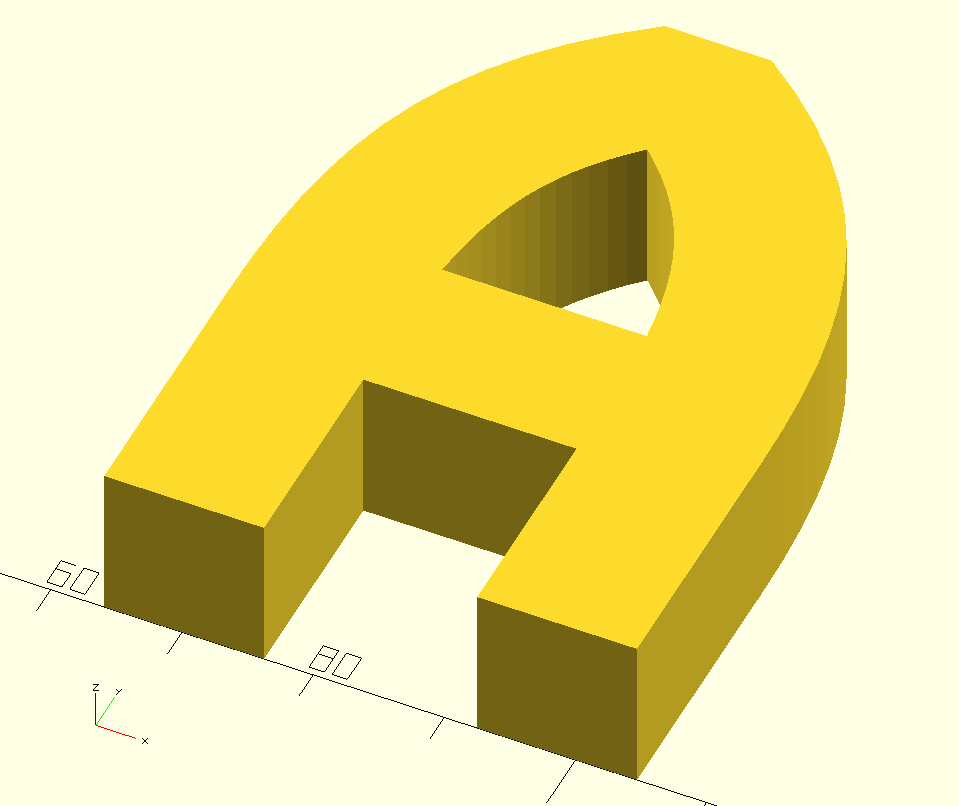
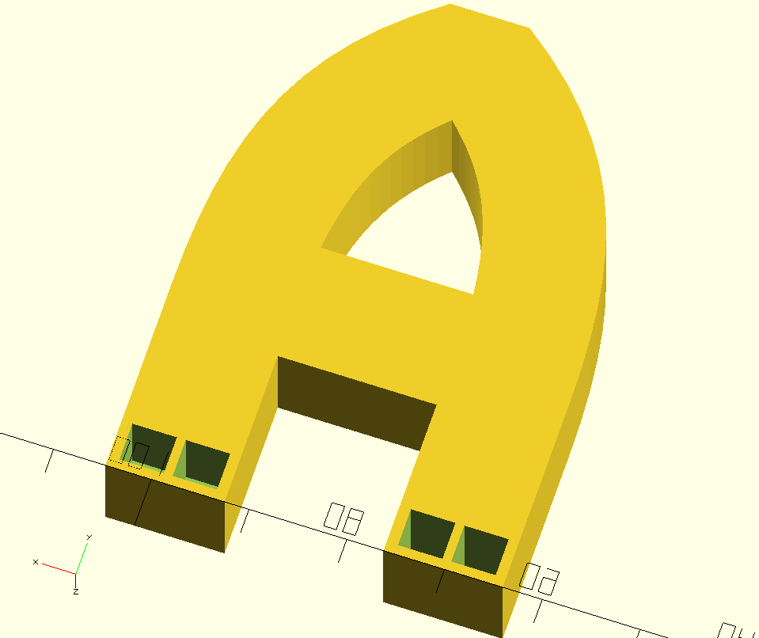

# 3D Letter
This is a SCAD Model for 3D letters.
<br>

## Usage example

- call "3d_letter("A",fontSize,thickness)" to get a plain letter with selected size.

```
/* A */
translate([60,0,0])
	difference() {
	3d_letter("A",fontSize,thickness);
	
	/* add cutout into letter to place LEDs into */
	translate([5.1,1,-1]) ledPlate();
	translate([33.6,1,-2]) ledPlate();
}
```

**WORK IN PROGRESS!**
This Model for OpenSCAD has not been printed by me. I will upload photos
of the printed case. I did not test all letters!



<br>

<br>
<br>
<br>
<br>

# LICENSE

<dl>
<a rel="license" href="http://creativecommons.org/licenses/by-sa/4.0/"></a><br />Dieses Werk ist lizenziert unter einer <a rel="license" href="http://creativecommons.org/licenses/by-sa/4.0/">Creative Commons Namensnennung - Weitergabe unter gleichen Bedingungen 4.0 International Lizenz</a>.
</dl>

<dl>
<a rel="license" href="http://creativecommons.org/licenses/by-sa/4.0/"></a><br />This work is licensed under a <a rel="license" href="http://creativecommons.org/licenses/by-sa/4.0/">Creative Commons Attribution-ShareAlike 4.0 International License</a>.
</dl>
